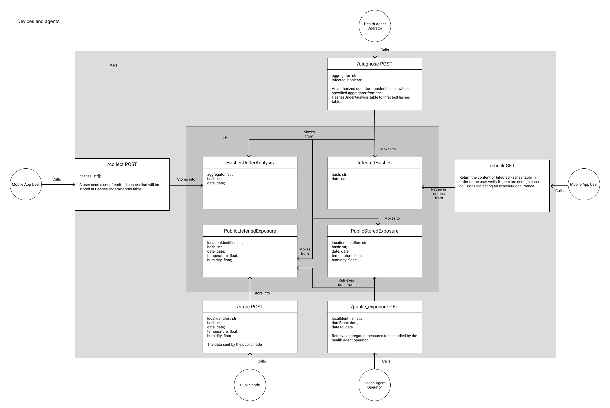

# dp3t-usp

This project implements a DP3T implementation with an embedded system device. The project is meant to be used with a ESP32 module, a mobile smartphone, and a dedicated database.

###### Components
- Android app
- ESP32 code 
- Database
- API

The objective of the embedded system is to capture hashes being transmited through Bluetooth Low Energy Protocol with a specific service uuid. The device also captures ambient data such as tempeture and humidity through the use of a DHT sensor connected to the module.

Through the use of BLE Protocol, the module transmits data between itself and a specially developed phone app to keep eyes on the status of people regarding the monitored disease and the likelyhood of being infected.

The smartphone app searches for hashes and generates its own, transmiting them through BLE. The generated and listened hashes are stored in the internal memory, and either sent to the database or deleted in case a period of time is lapsed. 

The module gathers data on people with the apps, the time of receival of their hashes as well as the local humidity and temperature, and sends this data towards an API that uses this data to construct percentages on the amount of people infected and the amount of people healthy, as well as trying to find correlations between the amount of infected people and the current enviromental conditions. This data is then sent through Wi-Fi protocol to specialists so that they may use this data as they see fit. 

An API controls the logic of data in the database and handles the requests sent to it.

the database is composed of 4 tables to store infected hashes, suspected hashes, hashes captured through public nodes and infected hashes of public nodes. 
